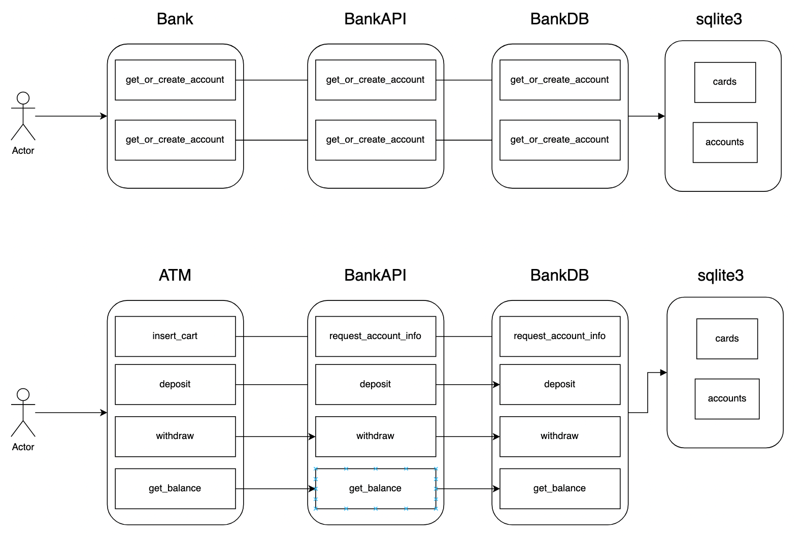

# ATM Controller


1. structure
2. database
3. Usage


## 1. Structure




**Bank**

- Get_or_create_account
- Get_or_create_card


**ATM**

- Insert_card
- deposit
- withdraw
- get_balance


**BankAPI**

- bankingAPI


**bankDBConroller**

- bank db controller


## 2. Database

cards

- id
- Card_number
- Card_pin
- account_id (FK)


accounts

- customer_name
- account_number
- balance


## 3. Usage

1) create account and card

2) insert_card with pin_number and do deposit/withdraw/balance


**Example Code**) src/test.py

```python
from bank import Bank
from atm_controller import ATMController

# [Bank] create bank for get_or_create account and card
bearbank = Bank()

# 1-1) create account with name
account_number =bearbank.get_or_create_account("chandler")
print(account_number)

# 1-2) create card number with name and pin number
card_number = bearbank.get_or_create_card("chandler","1234")
print(card_number)


# [ATM] create ATM
atm = ATMController()

# 2-1) insert card with pin number
print(atm.insert_card(card_number,"1234"))

# 2-2) deposit
print(atm.deposit(4000))

# 2-3) insert again for withdraw
print(atm.insert_card(card_number,"1234"))
print(atm.withdraw(4000))

# 2-4) insert again for get balance
print(atm.insert_card(card_number,"1234"))
print(atm.get_balance())
```

